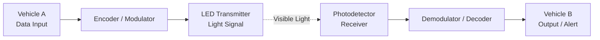
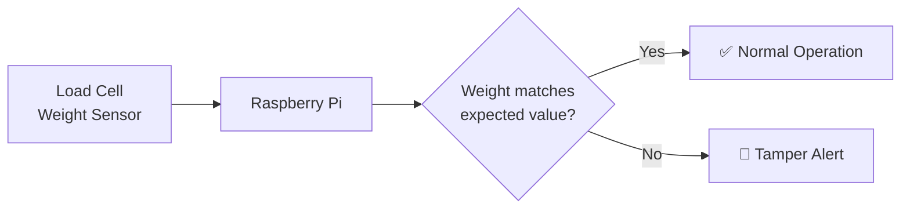
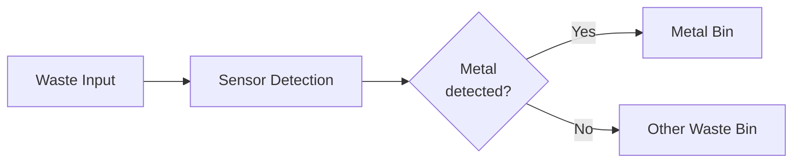

<!-- ═══════════════ HEADER ═══════════════ -->


<p align="center">
  
</p>

<p align="center">
  
  
  
</p>

<p align="center">
  <a href="https://www.linkedin.com/in/soma-sundaram-b-9510aa2b1"></a>
  <a href="mailto:YOUR-EMAIL@gmail.com"></a>
  
  
</p>

---

## ⚡ `whoami`

```text
┌──────────────────────────────────────────────────────┐
│  NAME      : Soma Sundaram                           │
│  HANDLE    : @somu-cyber                             │
│  STATUS    : Final-year student → seeking first role │
│  FOCUS     : Python · Networking · Embedded · Comms  │
│  APPROACH  : Build it, break it, document it         │
└──────────────────────────────────────────────────────┘
```

I build projects where **hardware meets software**: light-based vehicle communication, Pi-powered anti-tamper systems, and automated waste sorting. I'm sharpening my **Python** and **networking** fundamentals and looking for a team where I can learn fast and ship real things.

---

## 🛠️ Tech Arsenal

<p align="center">
  
</p>

<details>
<summary><b>📚 Skills breakdown (click to expand)</b></summary>
<br>

| Domain | Focus areas |
|:--|:--|
| 🐍 **Programming** | Python (actively learning and building) |
| 🌐 **Networking** | Network fundamentals, communication protocols |
| 📡 **Communication Systems** | Li-Fi / Visible Light Communication, V2V concepts |
| 🔌 **Embedded / IoT** | Raspberry Pi, sensors, hardware interfacing |
| 🧰 **Tools** | Git, GitHub, Linux, VS Code |

</details>

---

## 🚀 Featured Projects

<table>
<tr>
<td width="50%" valign="top">

### 📡 Li-Fi Vehicle-to-Vehicle Communication
Next-generation V2V communication using **Li-Fi** (data over light) to enable fast, interference-resistant messaging between vehicles.

`Li-Fi` `VLC` `Communication` `Embedded`

[**→ View Repository**](https://github.com/somu-cyber/REPO-NAME)

</td>
<td width="50%" valign="top">

### ⚖️ Jewellery Store Weight Tamper Detector
A **Raspberry Pi based** machine that detects weight tampering in jewellery stores, protecting both the shop and customers.

`Raspberry Pi` `Python` `Sensors` `IoT`

[**→ View Repository**](https://github.com/somu-cyber/REPO-NAME)

</td>
</tr>
<tr>
<td colspan="2" valign="top">

### ♻️ Dry Metal Waste Segregation System
An automated system that identifies and **segregates dry metal waste** from other waste, supporting cleaner recycling.

`Automation` `Sensors` `Embedded` `Sustainability`

[**→ View Repository**](https://github.com/somu-cyber/REPO-NAME)

</td>
</tr>
</table>

### 🧩 Project architecture

> These diagrams are starting points. Edit the boxes so they match how your projects actually work.

<details>
<summary><b>📡 Li-Fi V2V: system flow</b></summary>



</details>

<details>
<summary><b>⚖️ Weight Tamper Detector: system flow</b></summary>



</details>

<details>
<summary><b>♻️ Waste Segregation: system flow</b></summary>



</details>

---

## 📊 GitHub Analytics

<p align="center">
  
  
</p>

<p align="center">
  
</p>

<p align="center">
  
</p>

<p align="center">
  
</p>

---

## 🗺️ Learning Roadmap

| Track | Progress |
|:--|:--|
| 🐍 Python |  |
| 🌐 Networking |  |
| 🔌 Embedded / IoT |  |
| 🧠 DSA & Problem Solving |  |

## 🎯 Career Goals

- 💼 Seeking an **entry-level role** in **networking, embedded/IoT, communication systems or Python development**
- 🤝 Looking for a team that values hands-on building and learning in public
- 📍 Open to opportunities, ready to start immediately after graduation

---

## 📬 Let's Build Something Together

<p align="center">
  <a href="https://www.linkedin.com/in/soma-sundaram-b-9510aa2b1">
    
  </a>
  <a href="mailto:YOUR-EMAIL@gmail.com">
    
  </a>
</p>

<p align="center"><i>"First make it work, then make it better."</i></p>


